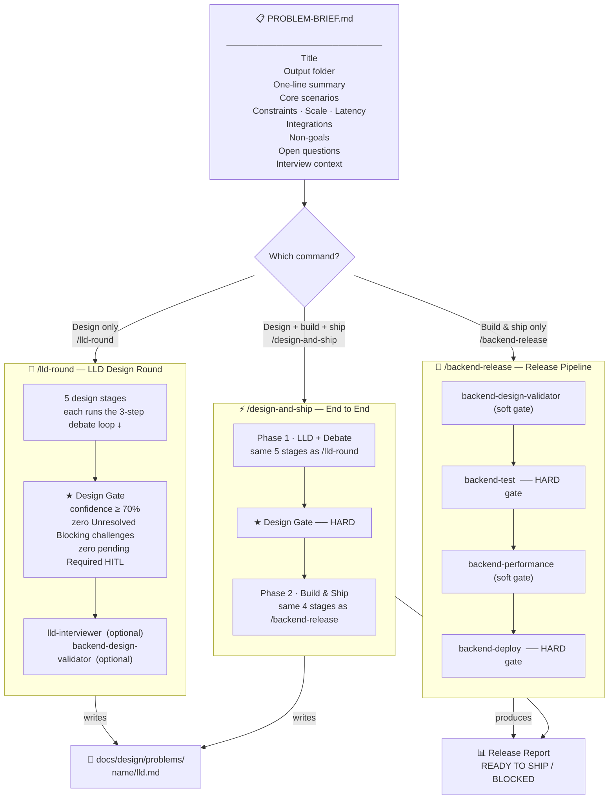
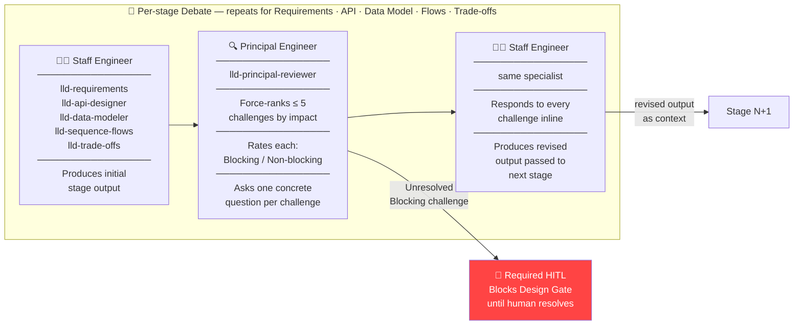
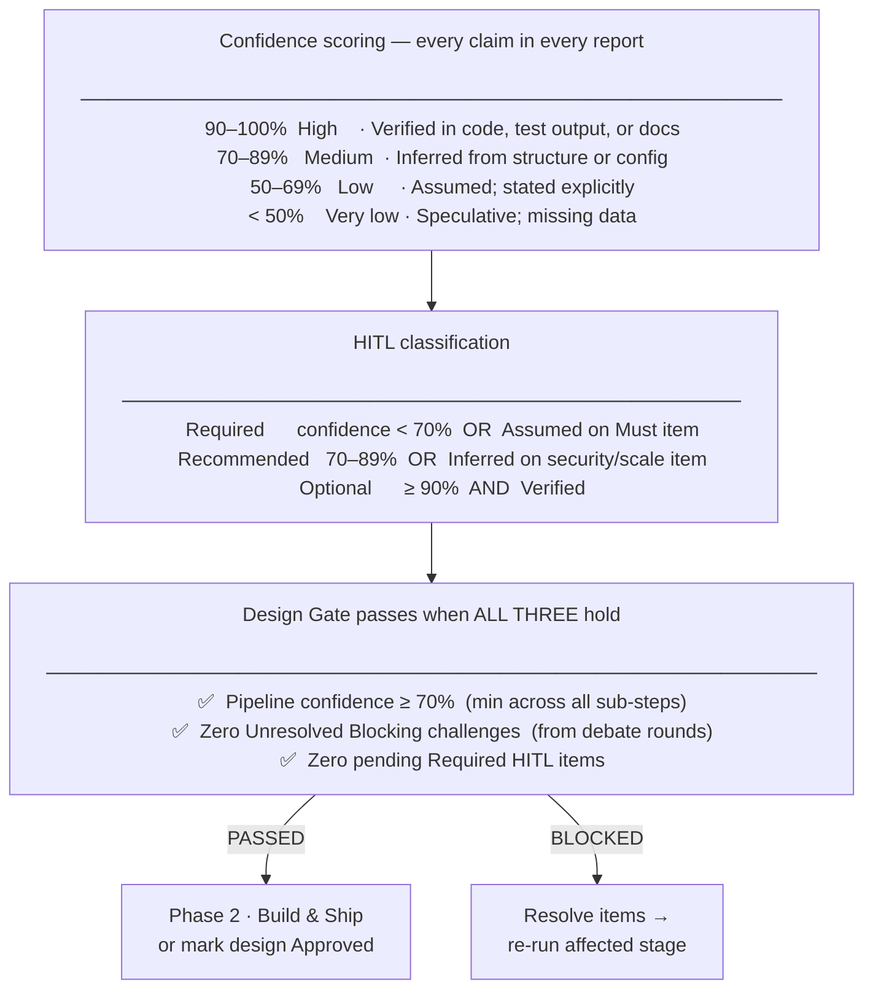
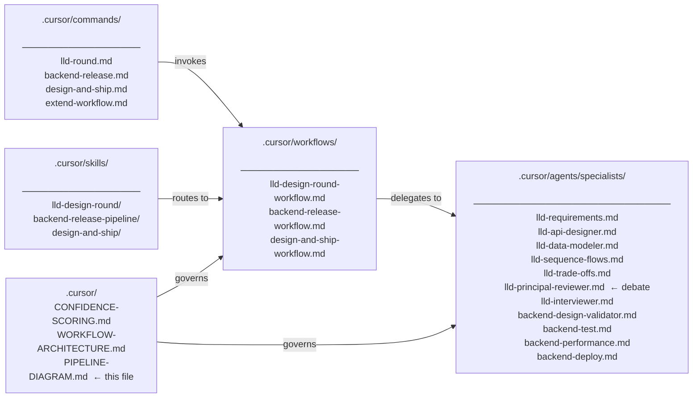

# Pipeline Diagram

Visual reference for the backend-lld-kit workflow system.

---

## 1 — Start here: fill PROBLEM-BRIEF.md, then pick a command

---

## 2 — The per-stage debate loop (runs × 5 inside LLD Design Round)

---

## 3 — Confidence & gate rules at a glance

---

## 4 — Full artifact map

