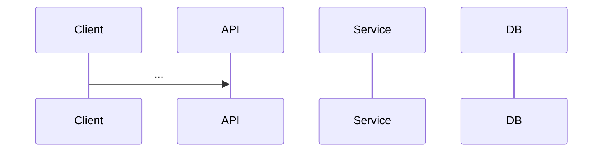

# Low-Level Design: [Feature / System Name]

**Author**:  
**Date**:  
**Status**: Draft | Review | Approved  
**Pipeline confidence**: NN% (from `/design-round`)  
**HITL**: N required / N recommended / N optional — see Human validation log  
**Related**: [requirements brief, ticket, ADR links]

---

## 1. Problem statement

[What we're building and why — 2–4 sentences]

## 2. Requirements

### Functional
| ID | Requirement | Priority |
|----|-------------|----------|
| FR-1 | | Must |

### Non-functional
| ID | Requirement | Target |
|----|-------------|--------|
| NFR-1 | Latency (chat p95) | e.g. < 3s |

### Assumptions
- 

### Out of scope
- 

---

## 3. API design

### Base URL & auth
- 

### Endpoints
<!-- Repeat per endpoint -->
#### `METHOD /api/v1/...`
**Purpose**:  
**Request**:  
**Response**:  
**Errors**:  

---

## 4. Data model

### Storage overview
| Store | Purpose |
|-------|---------|

### Entities
<!-- tables, indexes, relationships -->

### Migrations
- 

---

## 5. Sequence flows

### Flow: [e.g. Document upload & ingest]

### Failure handling
| Scenario | Behavior |
|----------|----------|

---

## 6. Component / class sketch

| Component | Responsibility |
|-----------|----------------|
| | |

---

## 7. Trade-offs & decisions

### Decision: [Title]
- **Options considered**:  
- **Chosen**:  
- **Rationale**:  

---

## 8. Testing strategy

| Layer | Approach |
|-------|----------|
| Unit | |
| Integration | |
| API / contract | |
| Retrieval quality | |

---

## 9. Observability & ops

- Metrics:  
- Logs:  
- Alerts:  
- Health checks:  

---

## 10. Open questions

- 

---

## 11. Human validation log (HITL)

| Section | Item | Confidence % | Evidence | HITL | Human decision |
|---------|------|----------------|----------|------|----------------|
| | | | Verified / Inferred / Assumed | Required / Recommended / Optional | Pending / Approved / Rejected |

**Sign-off**: ___________________ **Date**: ___________
