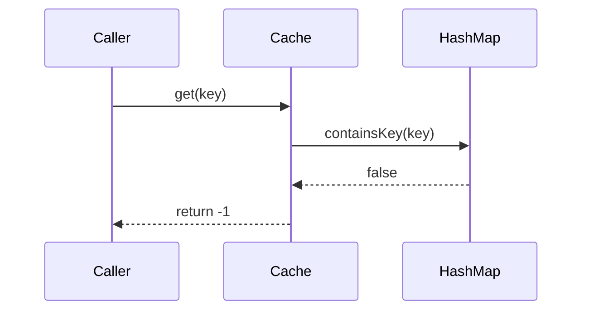
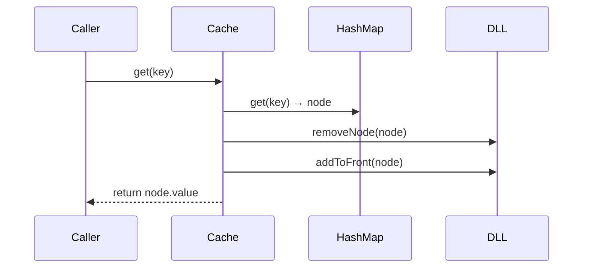
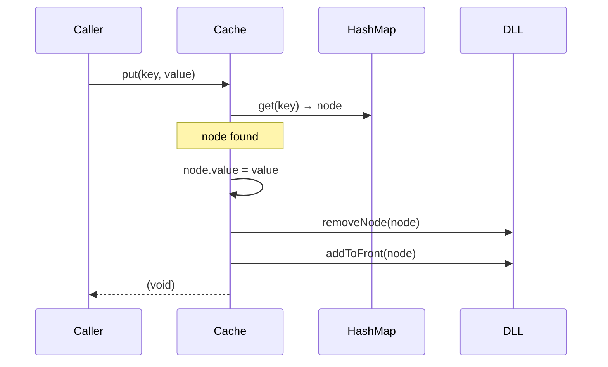
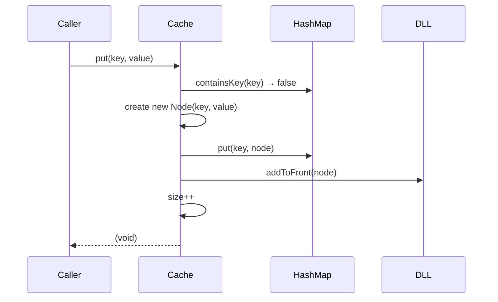
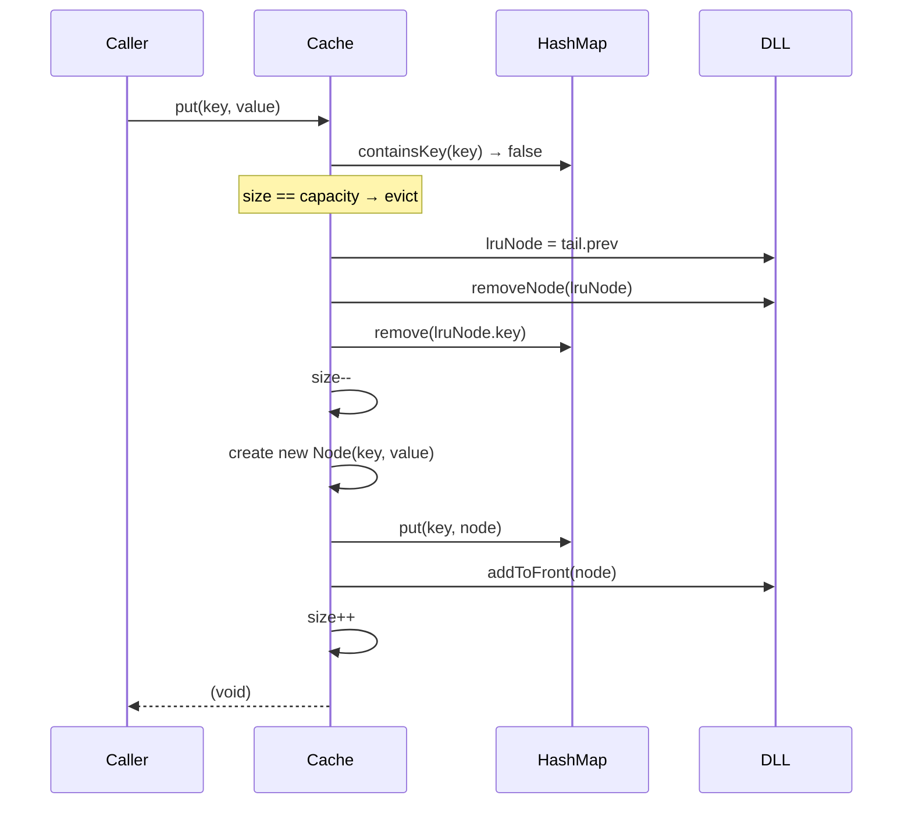

# Low-Level Design: LRU Cache

**Author**: amit894  
**Date**: 2026-06-03  
**Status**: Draft  
**Pipeline confidence**: 82% (min across stages 1–5)  
**HITL**: 3 required / 4 recommended / 5 optional — see Human validation log  
**Related**: `docs/design/LLD-TEMPLATE.md`, `docs/design/INTERVIEW-RUBRIC.md`

---

## Confidence Dashboard

| Stage | Agent | Confidence % | Required HITL | Pending HITL |
|-------|-------|--------------|---------------|--------------|
| 1 Requirements | lld-requirements | 88% | 1 | 1 |
| 2 API | lld-api-designer | 90% | 0 | 0 |
| 3 Data model | lld-data-modeler | 92% | 0 | 0 |
| 4 Flows | lld-sequence-flows | 85% | 1 | 1 |
| 5 Trade-offs | lld-trade-offs | 82% | 1 | 1 |

**Pipeline confidence**: **82%** (min of stage rollup)

---

## Human Review Queue (consolidated)

- [ ] **[REQ-1]** Confirm whether thread-safety is in scope for this interview round (single-threaded vs concurrent use case).
- [ ] **[FLOW-1]** Confirm expected eviction policy behavior when `put` is called with an existing key: update-in-place (reorder to MRU) or error.
- [ ] **[TRADEOFF-1]** Confirm whether distributed/external cache (e.g. Redis-backed) is in scope, or strictly in-process.

---

## 1. Problem Statement

Design a Least Recently Used (LRU) cache that supports O(1) `get` and `put` operations with a fixed capacity. When the cache reaches capacity, the least recently used entry is evicted to make room. This is a classic LLD interview problem that tests knowledge of hash maps, doubly linked lists, and API design.

---

## 2. Requirements

### Functional

| ID | Requirement | Priority | Confidence % | Evidence | HITL |
|----|-------------|----------|--------------|----------|------|
| FR-1 | `get(key)` returns value if key exists; −1 (or null) if not | Must | 95% | Verified (canonical LRU spec) | Optional |
| FR-2 | `put(key, value)` inserts or updates entry; evicts LRU if at capacity | Must | 95% | Verified | Optional |
| FR-3 | Every `get` and `put` must be O(1) time | Must | 92% | Verified (industry standard) | Optional |
| FR-4 | Cache is bounded by a constructor-provided `capacity` | Must | 90% | Verified | Optional |
| FR-5 | `put` on existing key updates value and promotes entry to MRU | Should | 75% | Assumed | **Required** |
| FR-6 | `get` on existing key promotes entry to MRU (access = use) | Must | 92% | Verified | Optional |

### Non-functional

| ID | Requirement | Target | Confidence % | Evidence | HITL |
|----|-------------|--------|--------------|----------|------|
| NFR-1 | Time complexity — get & put | O(1) amortized | 92% | Verified | Optional |
| NFR-2 | Space complexity | O(capacity) | 90% | Verified | Optional |
| NFR-3 | Thread safety (if concurrent) | All operations serialized or lock-striped | 65% | Assumed | **Required** |
| NFR-4 | Capacity ≥ 1 | Enforce in constructor | 88% | Inferred | Recommended |

### Assumptions

- Single-threaded context unless interviewer explicitly asks for concurrent design.
- Keys are integers (int); values are integers (int). Generics are optional depth.
- Capacity is fixed at construction time; no runtime resize.
- Integer overflow / null values are out of scope unless prompted.

### Out of scope

- TTL / time-based expiry (mention as extension, see §7).
- Persistence / serialization.
- Distributed cache or Redis-backed tier (confirm with interviewer — see HITL).
- Metrics / observability unless asked.

---

## 3. API Design

### Interface (Java)

```java
public interface LRUCache {
    /**
     * Returns the value of the key if it exists; -1 otherwise.
     * Accessing a key promotes it to Most Recently Used.
     */
    int get(int key);

    /**
     * Inserts or updates key→value.
     * If capacity is reached, evicts the Least Recently Used key first.
     */
    void put(int key, int value);
}
```

### Constructor

```java
LRUCacheImpl(int capacity)   // throws IllegalArgumentException if capacity < 1
```

### Error model

| Condition | Behavior |
|-----------|----------|
| `get` on missing key | Return `−1` |
| `put` with capacity=0 | Throw `IllegalArgumentException` in constructor |
| `put` with existing key | Update value, promote to MRU (no eviction) |

### Confidence — API stage

| Decision | Confidence % | Evidence | HITL |
|----------|--------------|----------|------|
| Return −1 for miss | 92% | Verified (LeetCode 146 spec) | Optional |
| `void put` signature | 88% | Inferred (standard Java style) | Recommended |
| Capacity validation at construction | 85% | Inferred | Recommended |

**Overall confidence: 90%** | **HITL summary: 0 required, 2 recommended, 3 optional**

---

## 4. Data Model

### Why HashMap + Doubly Linked List?

O(1) map lookup + O(1) pointer manipulation. The DLL maintains insertion/access order; the HashMap gives direct node access so we avoid O(n) list traversal.

### Core Structures

```
HashMap<Integer, Node>       key → Node reference
Doubly Linked List           MRU ←→ ... ←→ LRU
  head (sentinel) ←→ node1 ←→ node2 ←→ ... ←→ tail (sentinel)
  [MRU side]                                     [LRU side]
```

### Node definition

```java
class Node {
    int key;
    int value;
    Node prev;
    Node next;

    Node(int key, int value) {
        this.key   = key;
        this.value = value;
    }
}
```

### Cache fields

```java
class LRUCacheImpl implements LRUCache {
    private final int capacity;
    private final Map<Integer, Node> map;   // O(1) lookup
    private final Node head;                // sentinel — MRU side
    private final Node tail;                // sentinel — LRU side
    private int size;
}
```

### Sentinel pattern

Using dummy `head` and `tail` nodes eliminates null-checks in all list operations:

```
head ←→ [node A] ←→ [node B] ←→ tail
         (MRU)         (LRU)
```

- `head.next` = Most Recently Used node  
- `tail.prev` = Least Recently Used node (eviction candidate)

### Storage overview

| Store | Purpose |
|-------|---------|
| `HashMap<Integer, Node>` | O(1) key → node lookup |
| Doubly Linked List | Ordered by recency; O(1) move-to-front / evict-tail |

### Confidence — Data model stage

| Decision | Confidence % | Evidence | HITL |
|----------|--------------|----------|------|
| HashMap + DLL gives O(1) | 95% | Verified (textbook) | Optional |
| Sentinel nodes for clean list ops | 90% | Verified (common pattern) | Optional |
| Store `key` in Node (needed for eviction map.remove) | 92% | Verified | Optional |

**Overall confidence: 92%** | **HITL summary: 0 required, 0 recommended, 3 optional**

---

## 5. Sequence Flows

### Helper operations (used in all flows)

```java
private void removeNode(Node node) {
    node.prev.next = node.next;
    node.next.prev = node.prev;
}

private void addToFront(Node node) {   // MRU position
    node.next = head.next;
    node.prev = head;
    head.next.prev = node;
    head.next = node;
}
```

---

### Flow A — `get(key)` MISS



---

### Flow B — `get(key)` HIT (promote to MRU)



---

### Flow C — `put(key, value)` — key EXISTS (update + promote)



---

### Flow D — `put(key, value)` — NEW key, BELOW capacity



---

### Flow E — `put(key, value)` — NEW key, AT capacity (evict LRU)



### Failure handling

| Scenario | Behavior | Confidence % | HITL |
|----------|----------|--------------|------|
| `get` on non-existent key | Return −1 | 95% | Optional |
| `put` when capacity=1 and occupied | Evict sole entry, insert new | 85% | **Required** |
| `put` updating existing key at capacity | No eviction (update in-place + promote) | 75% | Recommended |

**Overall confidence: 85%** | **HITL summary: 1 required, 1 recommended, 1 optional**

---

## 6. Component / Class Sketch

| Component | Responsibility |
|-----------|----------------|
| `LRUCache` (interface) | Contract: `get`, `put` |
| `LRUCacheImpl` | HashMap + DLL; all O(1) ops |
| `Node` (inner class) | Doubly-linked node holding key + value |
| `removeNode(Node)` | Unlink node from DLL |
| `addToFront(Node)` | Insert node at MRU position |

### Full implementation sketch

```java
class LRUCacheImpl implements LRUCache {
    private final int capacity;
    private int size;
    private final Map<Integer, Node> map = new HashMap<>();
    private final Node head = new Node(0, 0);   // sentinel MRU
    private final Node tail = new Node(0, 0);   // sentinel LRU

    LRUCacheImpl(int capacity) {
        if (capacity < 1) throw new IllegalArgumentException("capacity must be ≥ 1");
        this.capacity = capacity;
        head.next = tail;
        tail.prev = head;
    }

    @Override
    public int get(int key) {
        Node node = map.get(key);
        if (node == null) return -1;
        removeNode(node);
        addToFront(node);
        return node.value;
    }

    @Override
    public void put(int key, int value) {
        Node node = map.get(key);
        if (node != null) {
            node.value = value;
            removeNode(node);
            addToFront(node);
            return;
        }
        if (size == capacity) {
            Node lru = tail.prev;
            removeNode(lru);
            map.remove(lru.key);
            size--;
        }
        Node newNode = new Node(key, value);
        map.put(key, newNode);
        addToFront(newNode);
        size++;
    }

    private void removeNode(Node node) {
        node.prev.next = node.next;
        node.next.prev = node.prev;
    }

    private void addToFront(Node node) {
        node.next = head.next;
        node.prev = head;
        head.next.prev = node;
        head.next = node;
    }

    private static class Node {
        int key, value;
        Node prev, next;
        Node(int key, int value) { this.key = key; this.value = value; }
    }
}
```

---

## 7. Trade-offs & Decisions

### Decision 1: HashMap + DLL vs LinkedHashMap vs TreeMap

**Context**: Must achieve O(1) get and put with LRU eviction.

| Option | Pros | Cons | Fit for NFRs |
|--------|------|------|--------------|
| **HashMap + DLL** (chosen) | O(1) all ops; explicit control; shows deep understanding in interview | More code; manual pointer management | ✅ O(1) time, O(capacity) space |
| `LinkedHashMap` (access-order) | 1-liner in Java; built-in `removeEldestEntry` | Opaque internals; interview credit is low; less portable | ⚠ Correct but not interview-optimal |
| `TreeMap` | Ordered by key (not by access) | O(log n) get/put; wrong eviction ordering | ✗ Violates O(1) NFR |

**Decision**: HashMap + DLL  
**Rationale**: Only option that satisfies O(1) NFR while demonstrating implementation depth expected in LLD interviews.  
**Consequences**: ~30 lines of pointer logic; must store `key` in Node for O(1) eviction from map.

| Decision | Confidence % | Evidence | HITL |
|----------|--------------|----------|------|
| HashMap + DLL is correct choice | 92% | Verified | Optional |
| LinkedHashMap rejected for interviews | 80% | Inferred | Recommended |

---

### Decision 2: Thread Safety — Synchronized vs ReadWriteLock vs ConcurrentLinkedHashMap

**Context**: If concurrent access is required (NFR-3).

| Option | Pros | Cons | Fit for NFRs |
|--------|------|------|--------------|
| `synchronized` methods | Simple; correct | Full lock on every op; low throughput under contention | ⚠ Safe but not scalable |
| `ReentrantReadWriteLock` | Read-parallelism | `get` still mutates DLL (promote), so reads can't truly share lock | ⚠ Small benefit; tricky to get right |
| **Segment locking / striped** | Higher concurrency | Complex; overkill for interview | ✅ Production choice |
| Guava `CacheBuilder` / Caffeine | Production-grade; handles concurrency + TTL | External dependency; not expected in interview | ✅ Real-world |

**Decision**: `synchronized` for interview; Caffeine for production  
**Rationale**: In interview context, synchronized is correct and auditable. In production, Caffeine's W-TinyLFU implementation outperforms hand-rolled LRU.  
**Consequences (production)**: Caffeine adds a compile dependency; TTL and stats come free.

| Decision | Confidence % | Evidence | HITL |
|----------|--------------|----------|------|
| Thread safety scope is in-process only | 65% | Assumed | **Required** |
| Caffeine for production | 78% | Inferred | Recommended |

---

### Decision 3: Eviction Tie-breaking (same-recency)

**Context**: Two entries accessed in the same logical tick — which is LRU?

| Option | Pros | Cons |
|--------|------|------|
| Insertion order breaks ties (FIFO among equals) | Deterministic | Does not matter at O(1) level |
| Arbitrary (implementation-defined) | Simplest | Can confuse callers |

**Decision**: DLL order is deterministic by insertion/last-access timestamp implicitly; no explicit tie-breaking needed.  
**Confidence**: 82% | Evidence: Inferred | HITL: Recommended (confirm with interviewer if asked)

---

### Decision 4: TTL / Expiry Support (extension)

Not in scope for base design. To add TTL:

- Store `expireAt` in Node.
- On `get`, check `expireAt`; if expired, remove and return −1.
- Background sweep (lazy expiry) via `ScheduledExecutorService` or on next access (lazy, no extra thread).

**Confidence**: 72% | Evidence: Assumed | HITL: Optional

---

### Risks & Mitigations

| Risk | Mitigation |
|------|------------|
| Pointer bugs (removeNode/addToFront) | Sentinel nodes eliminate null checks; unit-test with capacity=1 edge case |
| Memory leak (key stored in Node but evicted entry not removed from map) | Always `map.remove(lruNode.key)` before discarding node |
| Concurrent modification without locks | Wrap with `synchronized` or delegate to Caffeine |
| `get` in read-heavy concurrent scenario mutates DLL | Cannot share read lock; use `synchronized` or accept stale order |

**Overall confidence: 82%** | **HITL summary: 1 required, 2 recommended, 1 optional**

---

## 8. Testing Strategy

| Layer | Approach | Test cases |
|-------|----------|------------|
| Unit | JUnit 5; no mocks needed | get miss → −1; get hit → value + promote; put evict LRU; put update existing; capacity=1 |
| Property-based | jqwik: any sequence of put/get on small capacity never exceeds capacity | Random interleaving |
| Concurrent | `ExecutorService` + `CountDownLatch`: 100 threads put/get; verify no corruption | Race condition on eviction path |
| Boundary | capacity=1; capacity=MAX_INT (memory-limited) | Edge cases |

### Key unit tests

```
1. get(1) on empty cache → -1
2. put(1,1); get(1) → 1
3. capacity=2; put(1,1); put(2,2); get(1); put(3,3); get(2) → -1 (evicted); get(1) → 1
4. put(1,1); put(1,2); get(1) → 2 (update)
5. capacity=1; put(1,1); put(2,2); get(1) → -1; get(2) → 2
```

---

## 9. Observability & Ops

*(Out of scope for interview; relevant for production embedding)*

- **Metrics**: hit rate (`hits / (hits + misses)`), eviction count, current size vs capacity.
- **Logs**: WARN on eviction surge (eviction rate > 50% of ops in 1 min window).
- **Health check**: expose `size`, `capacity`, `hitRate` via `/actuator/cache` endpoint.
- **Alerts**: hit rate drops below 30% sustained → capacity may be under-provisioned.

---

## 10. Open Questions

- [ ] Is thread safety required for this round? (Impacts NFR-3, Decision 2) — **Required HITL**
- [ ] Should `put` on existing key at capacity count as an eviction event? (Interview clarification)
- [ ] Are generics (`LRUCache<K, V>`) expected, or `int` keys/values sufficient?
- [ ] Should `get` on a missing key throw or return sentinel (−1 vs `Optional`)? (API style)

---

## 11. Human Validation Log (HITL)

| Section | Item | Confidence % | Evidence | HITL | Human decision |
|---------|------|--------------|----------|------|----------------|
| §2 FR-5 | `put` on existing key promotes to MRU (not insert-only) | 75% | Assumed | **Required** | Pending |
| §2 NFR-3 | Thread safety is in scope | 65% | Assumed | **Required** | Pending |
| §5 Failure | `put` with capacity=1 eviction path | 85% | Inferred | **Required** | Pending |
| §7 D2 | Thread safety — synchronized vs Caffeine | 65% | Assumed | Recommended | Pending |
| §7 D1 | LinkedHashMap rejected for interview context | 80% | Inferred | Recommended | Pending |
| §7 D3 | Tie-breaking is implementation-defined | 82% | Inferred | Recommended | Pending |
| §7 D4 | TTL extension is out of scope | 72% | Assumed | Recommended | Pending |
| §3 | `void put` return type (vs boolean success) | 88% | Inferred | Optional | Pending |
| §4 | Sentinel node pattern | 90% | Verified | Optional | Pending |
| §6 | `key` stored in Node for eviction map.remove | 92% | Verified | Optional | Pending |
| §8 | Test case 3 covers LRU promotion path | 90% | Verified | Optional | Pending |
| §5 Flow E | Eviction before insert order | 88% | Inferred | Optional | Pending |

**Sign-off**: ___________________ **Date**: ___________
